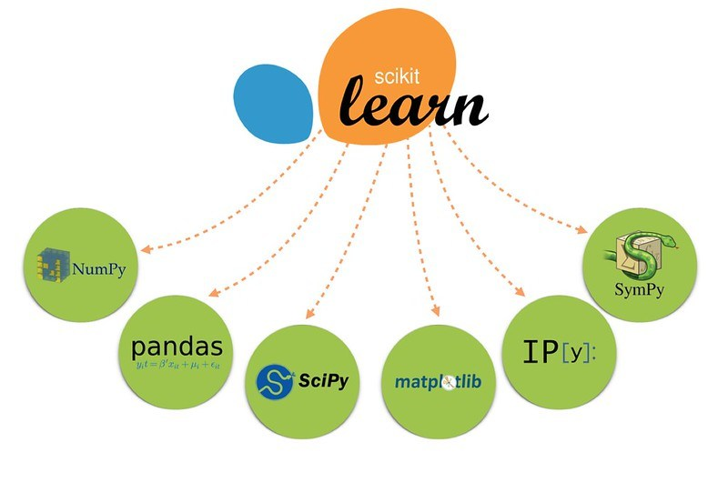

# Mineria de Datos con Python

Resositorio para realizar pruebas en Python de algoritmos de Minería de Datos y Machine Learning.

[Documentación Scikit-learn ⚡️](https://scikit-learn.org/)

[Link a documentación en Drive ⚡️](https://drive.google.com/open?id=1SF5qrml1lvR954akoj2bEdc8R59YGFW2)
<h1 align="center">
  
</h1>
<h5 align="center">Minería de Datos</h5>

### Clonar repositorio desde consola (Git Bash en Windows):
```
 git clone https://github.com/nicomateucci/MineriaDeDatosPython

```

## Entorno 🛠️

* **Python 2.7**
* **Librerias Python**
    * sklearn
    * pandas
* **Pip**

## Autor

* **Nicolas Mateucci** - *Minería de Datos con Python* - [Github oficial ⚡️](https://github.com/nicomateucci)

--------------------------------------------------------

### Plantillas README

[Ejemplos **muy buenos** de uso de Markdown Langauge](https://github.com/ricval/Documentacion/blob/master/Guias/GitHub/mastering-markdown.md#ejemplos)

[Modelo de plantilla para hacer un buen README ⚡️](https://gist.github.com/Villanuevand/6386899f70346d4580c723232524d35a)


🚀 📋 📦 🛠️ 📄 🎁 📢 🍺 🤓 🔧
